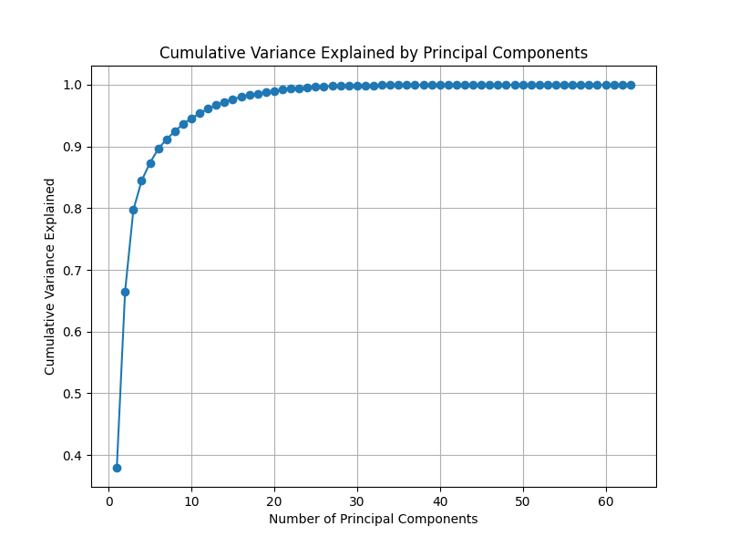
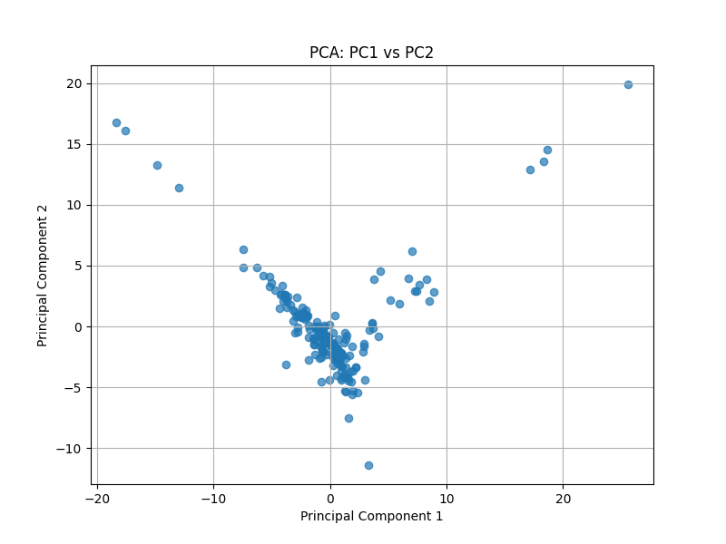

# Principal Component Analysis (PCA) Project on Economic Indicators

This project applies **Principal Component Analysis (PCA)** to a World Bank dataset containing economic indicators (e.g., GDP, inflation, trade). The goal is to analyze, reduce dimensionality, and visualize the relationships between countries and economic features.

---

## **Project Overview**

1. **Objective**: 
   - Perform PCA on economic indicators to identify the principal components explaining the majority of variance.
   - Visualize data in reduced dimensions (PC1 and PC2) to explore relationships between countries.

2. **Data Source**:  
   - The dataset used is from the **World Bank Open Data** platform.

3. **Tools Used**:
   - **Python Libraries**: `pandas`, `numpy`, `matplotlib`, `seaborn`, `scikit-learn`.

---

## **Folder Structure**

```plaintext
statistics-pca-project/
│
├── data/
│   └── README (Dataset not included but linked in the main README)
│
├── outputs/
│   ├── cumulative_variance_plot.png # Cumulative variance plot
│   ├── pca_scatter_plot.png         # Scatter plot of PC1 vs PC2
│   ├── pca_results.csv              # PCA results
│
├── Statistics_Project.py            # Python script for data analysis
│
└── README.md                        # Project overview and instructions
```

## **Dataset**
The dataset used in this project is publicly available from the World Bank Open Data platform.
You can download it directly from the following link:
World Bank - World Development Indicators

## **Steps to Reproduce**

1. **Clone the Repository**
```plaintext
git clone https://github.com/your-username/statistics-pca-project.git
cd statistics-pca-project
```
2. **Download the Dataset**
Download the World Development Indicators dataset from here and save it as WDICSV.csv in the data/ folder.

3. **Install Required Libraries**
Install the required Python libraries using the following command:
```plaintext
pip install numpy pandas matplotlib seaborn scikit-learn
```
4. **Run the Python Script**
Execute the script to perform PCA and generate outputs:
```plaintext
python Statistics_Project.py
```
5. **Output Files**
After running the script, the following files will be saved in the outputs/ folder:

- cumulative_variance_plot.png: Visualizes the cumulative variance explained.
- pca_scatter_plot.png: Scatter plot of the first two principal components.
- pca_results.csv: PCA-transformed data for further analysis.

## **Key Findings**

1. **Cumulative Variance**
- The first two principal components (PC1 and PC2) explain approximately 67% of the variance.
- The first three components explain nearly 80% of the variance, as shown in the cumulative variance plot.

2. **PCA Scatter Plot**
- Countries are visualized in a reduced 2D space (PC1 vs PC2), showing patterns and relationships based on economic indicators.
  
3. **Feature Loadings**
- The contributions of original indicators to the principal components are analyzed:
  - GDP (current US$) and Trade (% of GDP) contribute strongly to PC1.
  - Inflation, consumer prices has a smaller influence.

## **Results**

# **Cumulative Variance Plot**
This plot shows the cumulative variance explained by the principal components.


# **PCA Scatter Plot**
The scatter plot visualizes the first two principal components.


## **Insights**
- PCA effectively reduced the dimensionality of the dataset while retaining most of the variance.
- The scatter plot shows patterns and clustering among countries based on the selected economic indicators.

## **License**
This project is open source under the MIT License.

## **Contact**
For any questions or collaborations, please contact:

- Name: Ignace Mikelange Ngakala
- Email: Mikelange64@gmail.com
- GitHub: Mikelange64

---

### **Why This Works**
1. **Markdown Syntax**:
   - Proper headings (`#`, `##`, `###`) organize the content.
   - Code blocks (```) make commands easy to copy and execute.
   - Lists and links are formatted correctly for readability.

2. **Comprehensive Documentation**:
   - Clear sections for dataset, steps to reproduce, key findings, and results.
   - Output files are described and referenced with images.

3. **User-Friendly**:
   - Anyone visiting your GitHub repository can understand the project and follow the instructions without confusion.

---

### **Next Steps**
1. Save this text into a file called `README.md`.
2. Add it to your project folder.
3. Commit and push it to GitHub:
   ```bash
   git add README.md
   git commit -m "Add finalized README.md"
   git push origin main

